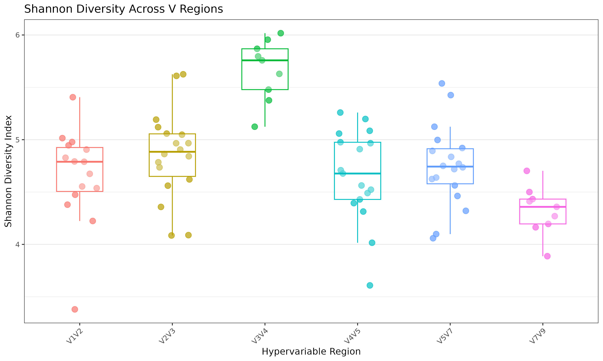
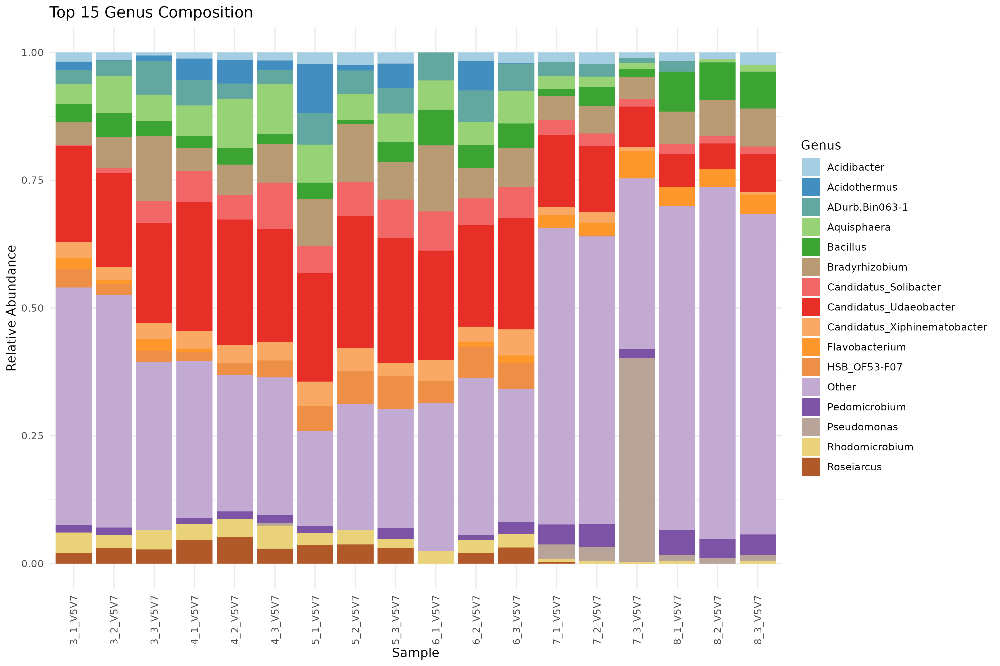
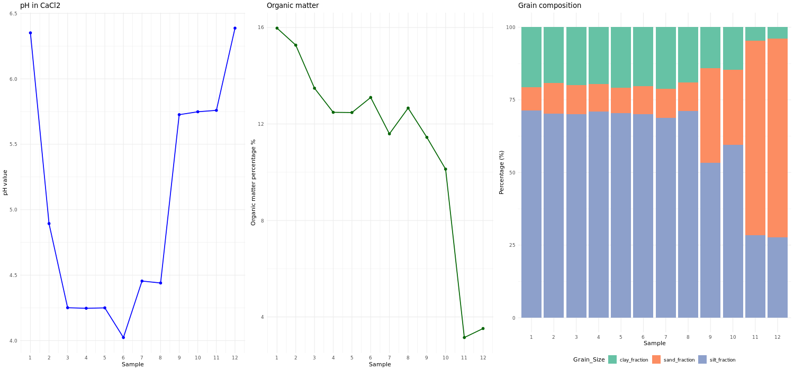
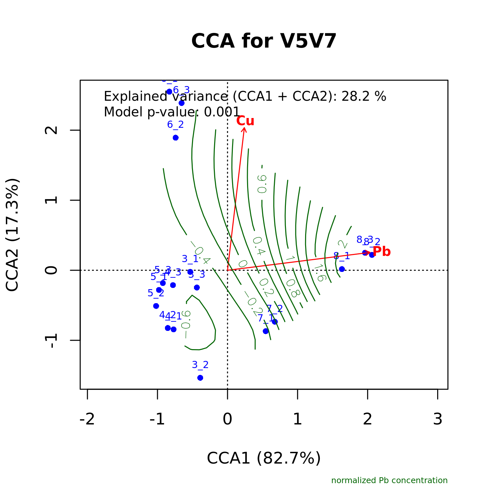

# 16S Microbiome Analysis Pipeline - bioTrace

## Overview
This repository contains R workflow for processing and analyzing 16S rRNA amplicon sequencing data from soil samples of an environmental gradient study. The pipeline covers data preprocessing, quality control, diversity analysis, and environmental variable associations.

## Example outputs 🔍

<div align="center">

| **Alpha diversity** | **Taxonomic composition** |
|-----------------|----------------|
| <br><em>Shannon diversity across samples</em> | <br><em>Genus-level composition</em> |
| **Metadata analysis** | **Environmental correlations** |
| <br><em>Metadata visualization</em> | <br><em>CCA with Pb/Cu concentrations</em> |

</div>

## Workflow summary

### **Core analysis**
| Script | Description |
|--------|-------------|
| `01_data_import.R` | Raw data import and phyloseq object creation |
| `01.5_V_regions_subsetting.R` | Subsets data by hypervariable regions (V1V2, V3V4, etc.) |
| `02_qc_zymoST.R` | Quality control using ZymoBIOMICS standards |
| `03_metadata_processing.R` | Processes environmental metadata (Pb, Cu concentrations) |

### **Diversity analysis**
| Script | Description |
|--------|-------------|
| `04.5_library_size.R` | Library size diagnostics and filtering |
| `04_rarefaction_diversity_analysis.R` | Rarefaction curve generation and depth optimization |
| `05_diversity_taxa_composition.R` | Alpha/beta diversity and taxonomic composition analysis |

### **Advanced analysis**
| Script | Description |
|--------|-------------|
| `06_CCA.R` | Canonical Correspondence Analysis with environmental variables |
| `07_maaslin_metadata.R` | Differential abundance analysis using MaAsLin2 |

## Folder structure 
```bash
├── 00_raw_data/          # Input files (RDS, Excel metadata)
├── plots/                # Generated visualizations
└── results/              # Final statistical outputs
```

## Key features 
- Dual analysis paths for raw vs filtered samples
- V-region specific processing
- Environmental metadata integration
- Publication-ready visualizations
- QC-focused pipeline design

## Dependencies
- Core R: `phyloseq`, `vegan`, `tidyverse`
- Visualization: `ggplot2`, `RColorBrewer`
- Statistics: `MaAsLin2`, `ggfortify`

## Usage
1. Run scripts sequentially from `01_` to `07_`
2. Adjust file paths in `01_data_import.R` for local setup
3. Modify V-region subsets in `01.5_` as needed
4. Outputs auto-save to `/plots` and `/results`
